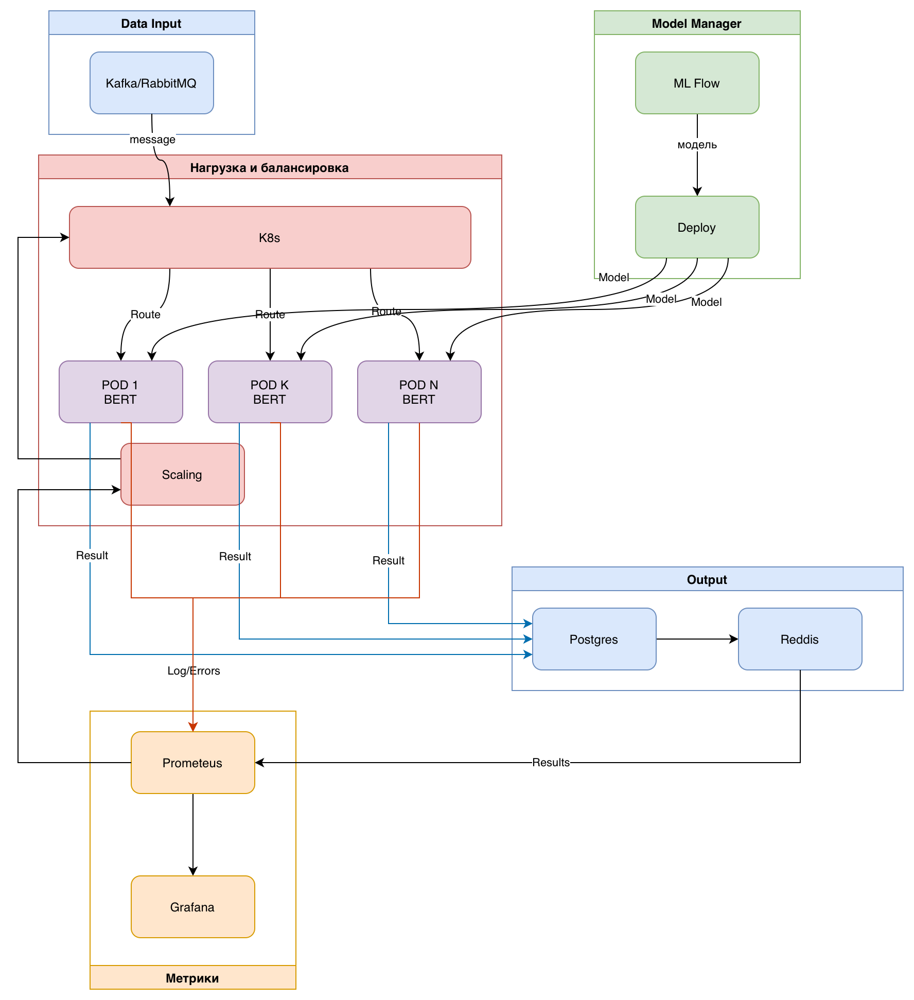

# Домашнее задание: Проектирование ML-системы — Задание 17

---

###### Курс: Проектирование систем машинного обучения
###### Уровень: 2 курс магистратуры
###### Вариант: 17
###### Команда: Алапанова Э.Х., Гимазетдинов Д.Р, Морозов А.Б.
###### Тема: Обнаружение языка ненависти в комментариях
###### Задание: Спроектируйте систему для обнаружения и пометки языка ненависти в комментариях на новостном сайте. Сосредоточьтесь на обработке текста и учете контекста

---

## Секция 1. Введение и постановка задачи

В современном цифровом медиа-пространстве комментарии являются ключевым драйвером вовлеченности (`User Engagement`), превращая пассивное чтение новостей в активную дискуссию. Однако с ростом аудитории неизбежно растет объем токсичного контента и «языка вражды» (`Hate Speech`).

Ручная модерация при наших объемах трафика становится экономически нецелесообразной и технически невозможной. Пропуск токсичных комментариев несет прямые репутационные риски и угрозу оттока аудитории, в то время как чрезмерная блокировка (`False Positives`) вызывает фрустрацию лояльных пользователей.

**Целью работы** является проектирование масштабируемую `ML-систему` для автоматического обнаружения и маркировки `Hate Speech` в режиме реального времени. Ключевой **особенностью** системы должна стать ***способность анализировать не только отдельные ключевые слова, но и семантический контекст (сарказм, неявная агрессия, учет истории треда)***, обеспечивая высокую точность классификации.

### Бизнес-цели и метрики успеха

Внедрение системы будет направлено на достижение следующих бизнес-показателей:

1. **Снижение операционных расходов (OpEx) на модерацию:**
    Цель: Автоматизировать обработку <u>95%+</u> входящего потока комментариев, оставляя для ручного разбора (`Human-in-the-loop`) только сложные граничные случаи (`edge cases`) с низкой уверенностью модели.

2. **Удержание пользователей (Retention Rate) и вовлеченность:**
    Цель: Снизить отток пользователей, вызванный токсичной средой, и повысить метрику «Время на сайте» (`Time Spent`), создавая безопасное пространство для дискуссий. (Чистые комментарии -> больше конструктивных дискуссий).

### Технические требования и ограничения (SLA/SLO)

Проектируемая система относится к классу `High Load / Real-time ML Inference`. Архитектура должна строго соответствовать следующим нефункциональным требованиям:

* **Задержка (Latency):**  Время отклика API — **не более 385 мс**. В эти 385 мс входит: сетевой оверхед, препроцессинг текста, инференс ML-модели и запись результата в БД.
* **Пропускная способность (Throughput):** Архитектура должна выдерживать пиковую нагрузку (Peak Load) в **18,225 RPS** без деградации сервиса.
* **Аудитория:** Система должна поддерживать **3,207,228 DAU** (Daily Active Users)
* **Отказоустойчивость (Availability):** Система должна быть спроектирована по принципу Shared-Nothing с отсутствием единой точки отказа (SPOF) для **обеспечения доступности 99.99%**.
* **Контекстуальность:** Алгоритм должен учитывать контекст обсуждения, чтобы минимизировать ложные срабатывания на лексике, которая может быть допустимой в определенном контексте (например, цитирование новостей), но недопустимой в качестве оскорбления.

---

## Секция 2. Формулировка ML-задачи и выбор модели

### 1. Определение ML-задачи

Задачу можно сформулировать как **Многоклассовая Классификация (Multiclass Classification)**. Это позволяет моделировать различные нюансы *агрессии* или типы *ненависти*, которые должны быть проанализированы (например, **сексизм**, **гомофобия**, **ксенофобия**, или классификация по **степени токсичности**).

**Целевая переменная:** Дискретная метка, представляющая категорию обнаруженного контента. Это будет один из классов: **«Сексизм»**, **«Гомофобия»**, **«Ксенофобия»**, **«Лукизм»** или **«Другое»**.

Для обучения модели, способной выполнять семантический и контекстуальный анализ, необходим размеченный набор данных. Типы данных необходимые системе:
* **Текстовые данные:** Основные входные данные — это текстовые сообщения, комментарии, посты.
* **Контекстуальные данные:** Поскольку требуется учет истории обсуждения/треда (контекста), данные должны включать не только изолированные сообщения, но и последовательности сообщений или векторные представления предыдущего контекста.
* **Размеченные данные:** Набор данных должен быть вручную или автоматически размечен метками, соответствующими целевой переменной (например, "токсичный/нетоксичный", или "сексизм/нейтральный" и т.п.).

### 2. Выбор модели

Для решения этой задачи классификации текстовых данных могут быть применены как классические методы машинного обучения, так и современные модели глубокого обучения, особенно те, что специализируются на обработке естественного языка (NLP).

Рассмотрим 2 подхода

#### A) Модели на основе трансформеров (Transformers):

**BERT (Bidirectional Encoder Representations from Transformers)**: Модели на основе архитектуры трансформеров, такие как BERT, показывают превосходную производительность в задачах классификации текста. Они способны улавливать контекст и семантические связи между словами, что критически важно для обнаружения неявной агрессии и сарказма (ключевая особенность вашей системы).

* Перимущества: Высокая производительность и точность в задаче классификации текста, использование трансферируемого обучения (Transfer Learning), обработка нюансов языка.
* Недостатки: Вычислительная ресурсоемкость, может отражать и усиливать доминирующие культурные нормы и демографические, социально-экономические или политические предубеждения.

#### B) Рекуррентные и сверточные нейронные сети:

Bi-LSTM (Bidirectional Long Short-Term Memory): Двунаправленная LSTM, которая учитывает контекст как до, так и после текущего слова, что важно для семантического анализа.

* Преимущества: Эффективен для последовательных данных, учитывает контекст, высокая точность
* Недостатки: Сильная зависимость от контекста, нестабильность при изменении признаков (добавлении или уменьшении)

Сверточные нейронные сети (CNN): могут распознавать основные свойства текста, такие как n-граммы и фразы, без сложной разработки признаков. В некоторых исследованиях CNN демонстрируют более высокую производительность для обнаружения токсичности, чем другие модели.

* Преимущества: Эффективность в извлечении признаков, способность оценивать короткие цепочки (большинство флуда и оскорблений в сети интернет), высокая производительность.
* Недостатки: Предназначется лучше для изображений, снижение производительности.

**Выбор:**

Модель **BERT подходит лучше всех для решения данной задачи**, поскольку она необходима для выполнения ключевых требований к качеству модели (семантический и контекстуальный анализ), несмотря на серьезные технические ограничения, связанные с задержкой и пропускной способностью.
Для соответствия жестким бизнес-целям и техническим требованиям, предъявляемым к системе класса High Load / Real-time ML Inference, необходимо использовать предобученную модель BERT в сочетании с передовыми методами MLOps и системного проектирования.

---

## Секция 3. Проектирование архитектуры

### 1. Высокоуровневая архитектура системы

Высокоуровневая архитектура (HLD) показывает, что система МО, готовая к эксплуатации, состоит из множества компонентов, включая стек данных, служебную инфраструктуру, пайплайн оценки и средства мониторинга.

На основе описанных компонентов архитектура будет выглядеть следующим образом:
1. Внешний уровень (Клиентский вход): Пользователи (Users) отправляют комментарии.
2. Уровень маршрутизации и безопасности: Load Balancer принимает и распределяет трафик (18,225 RPS) по сервисам.
3. Уровень инференса в реальном времени:
    ◦ Inference Service (Модель BERT/Kubernetes Pods): Основной компонент, выполняющий классификацию.
    ◦ Context/Feature Store (Распределенный кэш/Redis): Используется сервисом инференса для быстрого извлечения контекста обсуждения (истории треда).
4. Уровень данных и асинхронной обработки:
    ◦ Message Broker (Kafka/RabbitMQ): Буферизует входящие комментарии для обработки и передает результаты инференса (например, метки класса и уровень уверенности) для последующей записи и модерации.
    ◦ Monitoring System (Prometheus/Grafana): Собирает данные о задержке, пропускной способности, нагрузке на инстансы и качестве модели,.
    ◦ Result Database (PostgreSQL/NoSQL): Хранит результаты классификации, включая пограничные случаи для Human-in-the-loop.

### 2. Архитектура Data Pipeline

Опишем пайплайн, который сосредоточен в блоке `Offline Training (Офлайн-обучение)` и должен обеспечивать **высококачественные**, **размеченные** данные для обучения сложной модели BERT.

***Data Pipeline в сценарии использования***

***Data Pipeline подробнее***

### 3. Архитектура Training Pipeline

**Training Pipeline** визуализирует шаги, необходимые для разработки, оценки и регистрации готовой к эксплуатации модели.

***Тренировочный пайплайн в сценарии использования:***

***Архитектура тренировочного пайплайна:***

### 4. Архитектура Inference Pipeline (Serving)

---

## Секция 4. Расчёты и нефункциональные требования

### 1. Расчёт требований к хранилищу

Для расчёта взят средний объем текстового комментария с учетом метаданных и контекста треда, необходимого для работы модели BERT.

* **Объем одного запроса (комментарий + контекст):**
    * Средняя длина комментария: ~500 символов (1 байт/символ для UTF-8 латиницы, 2 байта для кириллицы).
    * Метаданные и история треда (контекст): ~1.5 КБ.
    * **Размер одной единицы данных:** ~2 КБ = 0.002 МБ.
* **Поток данных в секунду:**
    * [cite_start]Пиковая нагрузка (Peak Load): 18,225 RPS[cite: 27].
    * Поток: $18,225 \text{ RPS} \times 0.002 \text{ МБ} \approx 36.5 \text{ МБ/с}$.
* **Объем данных в день (при условии высокой загрузки):**
    * $36.5 \text{ МБ/с} \times 3600 \text{ с/час} \times 24 \text{ часа} \approx 3.15 \text{ ТБ/день}$.
* **Требуемое хранилище:**
    * **Сырые данные (Log retention 30 дней):** $3.15 \text{ ТБ/день} \times 30 \text{ дней} \approx 94.5 \text{ ТБ}$.
    * **База данных результатов (Postgres):** Хранение ID комментария, метки класса и вероятности (значительно меньше сырых данных) — порядка **5 ТБ**.
    * **Модели и MLOps артефакты:** Хранение версий BERT и логов экспериментов в S3/MLflow — **~200 ГБ**.
    * **Итого:** **~100 ТБ**.

### 2. Расчёт требований к пропускной способности (Throughput)

Система проектируется как High Load / Real-time ML Inference с жестким ограничением по времени отклика.

* **Требуемая пропускная способность:** 18,225 RPS.
* **SLA по задержке:** не более 385 мс (включая сетевой оверхед, препроцессинг, инференс и запись).
* **Производительность одного инстанса (BERT):**
    * Инференс модели BERT (Base/Large) ресурсоемок. Предположим использование оптимизированного инстанса (GPU T4 или специализированный CPU-инстанс) с пропускной способностью ~100 RPS (с учетом батчинга и ограничений по Latency).
* **Количество инстансов:**
    * $18,225 \text{ RPS} \div 100 \text{ RPS/инстанс} \approx 183$ инстанса.
    * С учетом запаса на отказоустойчивость (+20%): **~220 подов (Pods)** в Kubernetes кластере.
* **Требования к сети:**
    * **Входящий трафик:** $18,225 \text{ RPS} \times 0.002 \text{ МБ} \approx 36.5 \text{ МБ/с}$ (или ~300 Мбит/с).
    * **Исходящий трафик (ответ API):** JSON с меткой класса (например, «Сексизм») и confidence score занимает ~0.5 КБ.
        * $18,225 \text{ RPS} \times 0.0005 \text{ МБ} \approx 9.1 \text{ МБ/с}$.

### 3. Масштабируемость и надёжность

Архитектура спроектирована по принципу **Shared-Nothing** для обеспечения доступности 99.99%.

* **Масштабируемость:**
    * **Горизонтальное масштабирование (Compute):** Сервис инференса (Inference Service) развернут в Kubernetes. Настроен **HPA (Horizontal Pod Autoscaler)**, который добавляет поды при росте CPU/GPU utilization или увеличении лага в очереди Kafka.
    * **Асинхронная обработка:** Использование брокера сообщений (Kafka/RabbitMQ) позволяет сглаживать пиковые нагрузки (Backpressure), буферизируя комментарии перед обработкой, чтобы не потерять данные при всплесках трафика выше 18k RPS.
* **Надёжность и отказоустойчивость:**
    * **Отсутствие единой точки отказа (No SPOF):** Балансировщик нагрузки распределяет трафик между множеством реплик.
    * **Human-in-the-loop:** Сложные случаи (низкая уверенность модели) не отбрасываются, а сохраняются в БД для ручной проверки экспертами, что снижает риски репутационных потерь.
    * **Мониторинг:** Prometheus собирает метрики задержки (Latency) и пропускной способности, Grafana визуализирует состояние системы в реальном времени.
    * **Self-healing:** Kubernetes автоматически перезапускает упавшие контейнеры через механизм Liveness/Readiness probes.

---

## Список литературы

1.  Аминиан, Али. System Design. Машинное обучение. Подготовка к сложному интервью / Али Аминиан, Алекс Сюй. – Санкт-Петербург : Питер, 2024. – 320 с. – (Библиотека программиста). – ISBN 978-5-4461-2130-4.
2.  Сюй, Алекс. System Design. Подготовка к сложному интервью / Алекс Сюй. – Санкт-Петербург : Питер, 2022. – 304 с. – (Библиотека программиста). – ISBN 978-5-4461-1816-8.
3.  Клеппман, Мартин. Designing Data-Intensive Applications: The Big Ideas Behind Reliable, Scalable, and Maintainable Systems / Мартин Клеппман. – [О’Райли Медиа], [2017]. – [616 с.].
4.  Вон, Вернон. Implementing Domain-Driven Design / Вернон Вон. – [Аддисон-Уэсли], [2013]. – [584 с.].
5.  Захаренко, Д. В. Использование нейронных сетей глубокого обучения для классификации токсичных комментариев в социальных сетях / Д. В. Захаренко // Информатика. Экономика. Управление – Informatics. Economics. Management. – 2023. – Т. 2, № 4. – С. 0119-0133. – DOI: [https://doi.org/10.47813/2782-5280-2023-2-4-0119-0133](https://doi.org/10.47813/2782-5280-2023-2-4-0119-0133).
6.  Amazon Compute Service Level Agreement // Amazon Web Services. – URL: [https://aws.amazon.com/compute/sla/](https://aws.amazon.com/compute/sla/) (дата обращения: [на момент публикации источника]).
7.  Compute Engine Service Level Agreement (SLA) // Google Cloud. – URL: [https://cloud.google.com/compute/sla](https://cloud.google.com/compute/sla) (дата обращения: [на момент публикации источника]).
8.  SLA summary for Azure services // Microsoft Azure. – URL: [https://azure.microsoft.com/en-us/support/legal/sla/summary/](https://azure.microsoft.com/en-us/support/legal/sla/summary/) (дата обращения: [на момент публикации источника]).
9.  MLOps (Machine Learning Operations) Методология машинного обучения // TAdviser. – [Год не указан]. – URL: [Полный URL отсутствует]. (Хроника 2025: Конвейер по управлению ИИ-моделями. Как в российских компаниях набирает популярность подход ModelOps).
10. Kubernetes Documentation // Kubernetes. – URL: [https://kubernetes.io/docs/](https://kubernetes.io/docs/) (дата обращения: [на момент публикации отчета]).
11. Apache Kafka Documentation // Apache Software Foundation. – URL: [https://kafka.apache.org/documentation/](https://kafka.apache.org/documentation/) (дата обращения: [на момент публикации отчета]).

