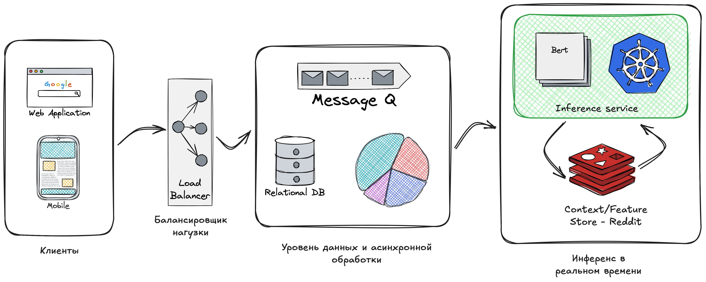
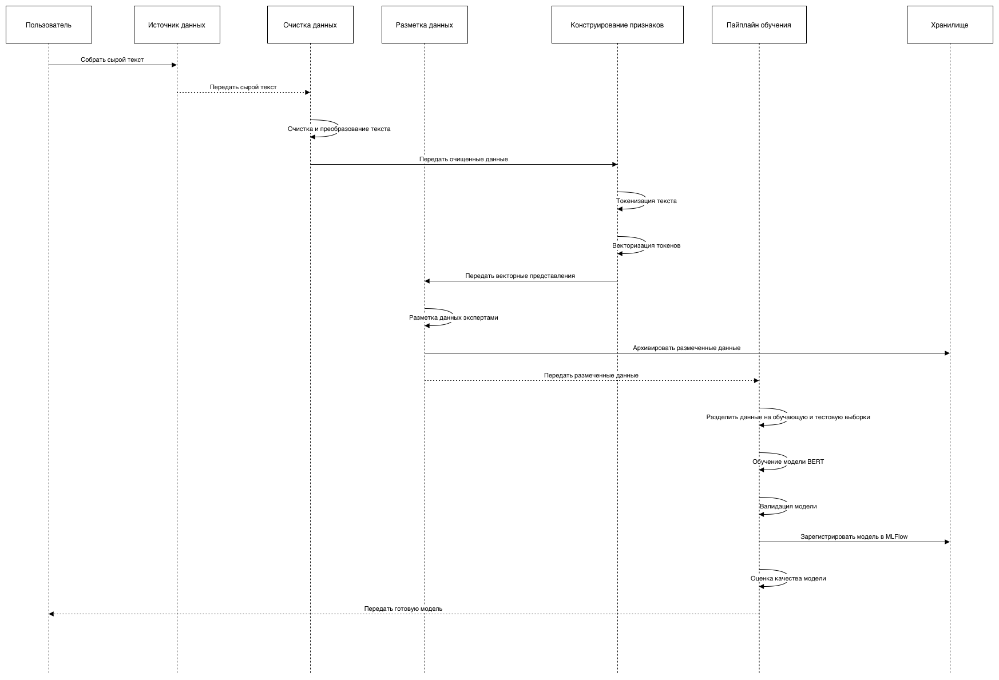

# Домашнее задание: Проектирование ML-системы — Задание 17

---

###### Курс: Проектирование систем машинного обучения
###### Уровень: 2 курс магистратуры
###### Вариант: 17
###### Команда: ...
###### Тема: Обнаружение языка ненависти в комментариях
###### Задание: Спроектируйте систему для обнаружения и пометки языка ненависти в комментариях на новостном сайте. Сосредоточьтесь на обработке текста и учете контекста

---

## Секция 1. Введение и постановка задачи

В современном цифровом медиа-пространстве комментарии являются ключевым драйвером вовлеченности (`User Engagement`), превращая пассивное чтение новостей в активную дискуссию. Однако с ростом аудитории неизбежно растет объем токсичного контента и «языка вражды» (`Hate Speech`).

Ручная модерация при наших объемах трафика становится экономически нецелесообразной и технически невозможной. Пропуск токсичных комментариев несет прямые репутационные риски и угрозу оттока аудитории, в то время как чрезмерная блокировка (`False Positives`) вызывает фрустрацию лояльных пользователей.

**Целью работы** является проектирование масштабируемую `ML-систему` для автоматического обнаружения и маркировки `Hate Speech` в режиме реального времени. Ключевой **особенностью** системы должна стать ***способность анализировать не только отдельные ключевые слова, но и семантический контекст (сарказм, неявная агрессия, учет истории треда)***, обеспечивая высокую точность классификации.

### Бизнес-цели и метрики успеха

Внедрение системы будет направлено на достижение следующих бизнес-показателей:

1. **Снижение операционных расходов (OpEx) на модерацию:**
    Цель: Автоматизировать обработку <u>95%+</u> входящего потока комментариев, оставляя для ручного разбора (`Human-in-the-loop`) только сложные граничные случаи (`edge cases`) с низкой уверенностью модели.

2. **Удержание пользователей (Retention Rate) и вовлеченность:**
    Цель: Снизить отток пользователей, вызванный токсичной средой, и повысить метрику «Время на сайте» (`Time Spent`), создавая безопасное пространство для дискуссий. (Чистые комментарии -> больше конструктивных дискуссий).

### Технические требования и ограничения (SLA/SLO)

Проектируемая система относится к классу `High Load / Real-time ML Inference`. Архитектура должна строго соответствовать следующим нефункциональным требованиям:

* **Задержка (Latency):**  Время отклика API — **не более 385 мс**. В эти 385 мс входит: сетевой оверхед, препроцессинг текста, инференс ML-модели и запись результата в БД.
* **Пропускная способность (Throughput):** Архитектура должна выдерживать пиковую нагрузку (Peak Load) в **18,225 RPS** без деградации сервиса.
* **Аудитория:** Система должна поддерживать **3,207,228 DAU** (Daily Active Users)
* **Отказоустойчивость (Availability):** Система должна быть спроектирована по принципу Shared-Nothing с отсутствием единой точки отказа (SPOF) для **обеспечения доступности 99.99%**.
* **Контекстуальность:** Алгоритм должен учитывать контекст обсуждения, чтобы минимизировать ложные срабатывания на лексике, которая может быть допустимой в определенном контексте (например, цитирование новостей), но недопустимой в качестве оскорбления.

---

## Секция 2. Формулировка ML-задачи и выбор модели

### 1. Определение ML-задачи

Задачу можно сформулировать как **Многоклассовая Классификация (Multiclass Classification)**. Это позволяет моделировать различные нюансы *агрессии* или типы *ненависти*, которые должны быть проанализированы (например, **сексизм**, **гомофобия**, **ксенофобия**, или классификация по **степени токсичности**).

**Целевая переменная:** Дискретная метка, представляющая категорию обнаруженного контента. Это будет один из классов: **«Сексизм»**, **«Гомофобия»**, **«Ксенофобия»**, **«Лукизм»** или **«Другое»**.

Для обучения модели, способной выполнять семантический и контекстуальный анализ, необходим размеченный набор данных. Типы данных необходимые системе:
* **Текстовые данные:** Основные входные данные — это текстовые сообщения, комментарии, посты.
* **Контекстуальные данные:** Поскольку требуется учет истории обсуждения/треда (контекста), данные должны включать не только изолированные сообщения, но и последовательности сообщений или векторные представления предыдущего контекста.
* **Размеченные данные:** Набор данных должен быть вручную или автоматически размечен метками, соответствующими целевой переменной (например, "токсичный/нетоксичный", или "сексизм/нейтральный" и т.п.).

### 2. Выбор модели

Для решения этой задачи классификации текстовых данных могут быть применены как классические методы машинного обучения, так и современные модели глубокого обучения, особенно те, что специализируются на обработке естественного языка (NLP).

Рассмотрим 2 подхода

#### A) Модели на основе трансформеров (Transformers):

**BERT (Bidirectional Encoder Representations from Transformers)**: Модели на основе архитектуры трансформеров, такие как BERT, показывают превосходную производительность в задачах классификации текста. Они способны улавливать контекст и семантические связи между словами, что критически важно для обнаружения неявной агрессии и сарказма (ключевая особенность вашей системы).

* Перимущества: Высокая производительность и точность в задаче классификации текста, использование трансферируемого обучения (Transfer Learning), обработка нюансов языка.
* Недостатки: Вычислительная ресурсоемкость, может отражать и усиливать доминирующие культурные нормы и демографические, социально-экономические или политические предубеждения.

#### B) Рекуррентные и сверточные нейронные сети:

Bi-LSTM (Bidirectional Long Short-Term Memory): Двунаправленная LSTM, которая учитывает контекст как до, так и после текущего слова, что важно для семантического анализа.

* Преимущества: Эффективен для последовательных данных, учитывает контекст, высокая точность
* Недостатки: Сильная зависимость от контекста, нестабильность при изменении признаков (добавлении или уменьшении)

Сверточные нейронные сети (CNN): могут распознавать основные свойства текста, такие как n-граммы и фразы, без сложной разработки признаков. В некоторых исследованиях CNN демонстрируют более высокую производительность для обнаружения токсичности, чем другие модели.

* Преимущества: Эффективность в извлечении признаков, способность оценивать короткие цепочки (большинство флуда и оскорблений в сети интернет), высокая производительность.
* Недостатки: Предназначется лучше для изображений, снижение производительности.

Выбор:

Модель **BERT подходит лучше всех для решения данной задачи**, поскольку она необходима для выполнения ключевых требований к качеству модели (семантический и контекстуальный анализ), несмотря на серьезные технические ограничения, связанные с задержкой и пропускной способностью.
Для соответствия жестким бизнес-целям и техническим требованиям, предъявляемым к системе класса High Load / Real-time ML Inference, необходимо использовать предобученную модель BERT в сочетании с передовыми методами MLOps и системного проектирования.

---

## Секция 3. Проектирование архитектуры

### 1. Высокоуровневая архитектура системы

Высокоуровневая архитектура (HLD) показывает, что система МО, готовая к эксплуатации, состоит из множества компонентов, включая стек данных, служебную инфраструктуру, пайплайн оценки и средства мониторинга.

На основе описанных компонентов архитектура будет выглядеть следующим образом:
1. Внешний уровень (Клиентский вход): Пользователи (Users) отправляют комментарии.
2. Уровень маршрутизации и безопасности: Load Balancer принимает и распределяет трафик (18,225 RPS) по сервисам.
3. Уровень инференса в реальном времени:
    ◦ Inference Service (Модель BERT/Kubernetes Pods): Основной компонент, выполняющий классификацию.
    ◦ Context/Feature Store (Распределенный кэш/Redis): Используется сервисом инференса для быстрого извлечения контекста обсуждения (истории треда).
4. Уровень данных и асинхронной обработки:
    ◦ Message Broker (Kafka/RabbitMQ): Буферизует входящие комментарии для обработки и передает результаты инференса (например, метки класса и уровень уверенности) для последующей записи и модерации.
    ◦ Monitoring System (Prometheus/Grafana): Собирает данные о задержке, пропускной способности, нагрузке на инстансы и качестве модели,.
    ◦ Result Database (PostgreSQL/NoSQL): Хранит результаты классификации, включая пограничные случаи для Human-in-the-loop.

### 2. Архитектура Data Pipeline

### 3. Архитектура Training Pipeline

### 4. Архитектура Inference Pipeline (Serving)

### 5. Архитектура хранилища данных (Data Storage)

---

## Секция 4. Расчёты и нефункциональные требования

---

## Список литературы

